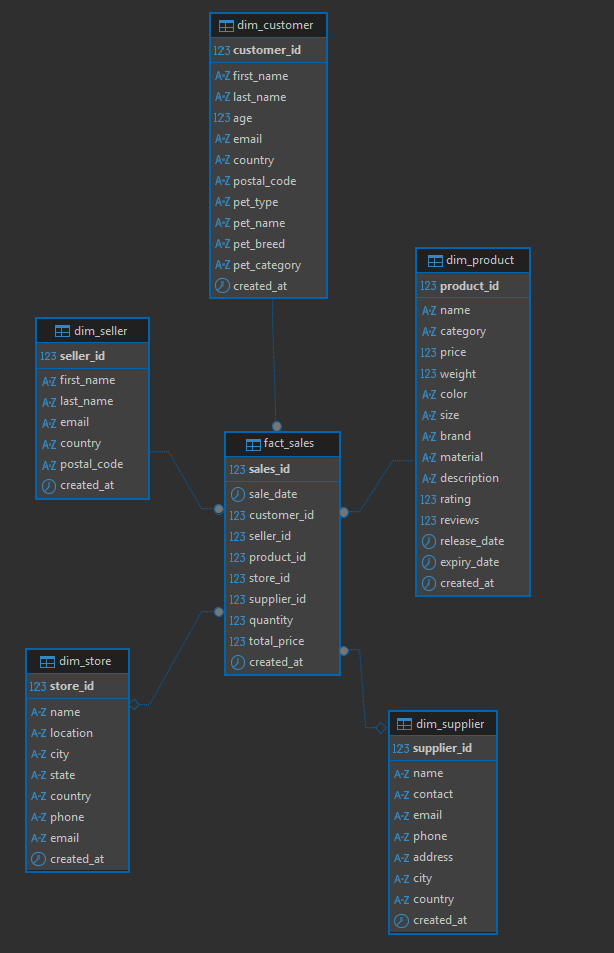
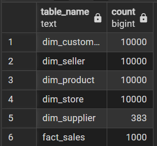

# BigDataFlink  
**Лабораторная работа №3: Потоковая обработка данных с использованием Apache Flink**

---

## 🚀 Быстрый старт

### 1. Запуск docker-compose
Из корневой директории `BigDataFlink-main`:
```bash
docker-compose up
```
### 2. Запуск flink_job

Из корня BigDataFlink-main: 

```bash
BigDataFlink-main> docker exec -it jobmanager /bin/bash ./bin/sql-client.sh -f /opt/flink/sql_job/etl.sql
```
### 3. Запуск docker-compose

Из корня BigDataFlink-main:

```bash
BigDataFlink-main> docker-compose --profile producer_runner up producer
```

## Результаты
### Связи таблиц:

### Итоговое заполнение:

```sql
SELECT 
    'dim_customer' as table_name, COUNT(*) as count FROM dim_customer
UNION ALL SELECT 
    'dim_seller', COUNT(*) FROM dim_seller
UNION ALL SELECT 
    'dim_product', COUNT(*) FROM dim_product
UNION ALL SELECT 
    'dim_store', COUNT(*) FROM dim_store
UNION ALL SELECT 
    'dim_supplier', COUNT(*) FROM dim_supplier
UNION ALL SELECT 
    'fact_sales', COUNT(*) FROM fact_sales;
```


##  Задание
Анализ больших данных - лабораторная работа №3 - Streaming processing с помощью Flink

Одним из самых популярных фреймворков для работы со streaming processing является Apache Flink. Apache Flink - мощный фреймворк, который предлагает широкий набор функциональности для простого написания streaming processing.

Что необходимо сделать? 

Необходимо реализовать потоковую обработку данных с помощью Flink, который читает топик Kafka, трансформирует данные в режиме streaming в модель звезда и пишет результат в PostgreSQL. Данные в Kafka-топиках хранятся в формате json. Данные в топик kafka нужно отправлять самостоятельно, эмулируя источник данных.

Какие данные отправляются в Kafka?
 - Каждое сообщение в Kafka-топике - это строчка из csv файлов, преобразованная в формат json.

Какие данные отправляются в PostgreSQL?
 - Трансформированные данные в модель данных звезда.


Алгоритм:

1. Клонируете к себе этот репозиторий.
2. Устанавливаете инструмент для работы с запросами SQL (рекомендую DBeaver).
3. Устанавливаете базу данных PostgreSQL (рекомендую установку через docker).
4. Устанавливаете Apache Flink (рекомендую установку через Docker).
5. Устанавливаете Apache Kafka (рекомендую установку через Docker).
6. Скачиваете файлы с исходными данными mock_data( * ).csv, где ( * ) номера файлов. Всего 10 файлов, каждый по 1000 строк.
7. Реализуете приложение, которое каждую строчку из исходных csv-файлов преобразует в json и отправляет в виде сообщения в Kafka-топик.
8. Реализуете приложение на Flink, которое читает Kafka-топик, преобразует данные в модель звезда и сохраняет в PostgreSQL в режиме streaming.
9. Проверяете конечные данные в PostgreSQL.
10. Отправляете работу на проверку лаборантам.

Что должно быть результатом работы?

1. Репозиторий, в котором есть исходные данные mock_data().csv, где () номера файлов. Всего 10 файлов, каждый по 1000 строк.
2. Файл docker-compose.yml с установкой PostgreSQL, Flink, Kafka и запуском приложения, которое из файлов mock_data(*).csv создает сообщения json в Kafka.
3. Инструкция, как запускать Flink-джобу и приложение для отправки данных в Kafka для проверки лабораторной работы.
4. Код Apache Flink для трансформации данных в режиме streaming.
